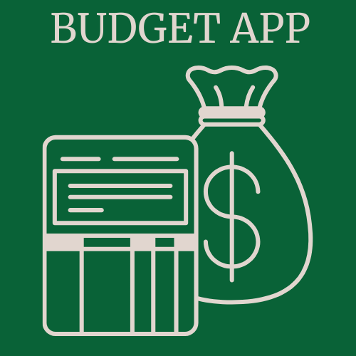

<div align="center">
  <br/>
 
  <h1><b>Budget App</b></h1>
</div>

<!-- TABLE OF CONTENTS -->

## 📗 Table of Contents

- [📖 Budget App](#-about-project)
  - [🛠 Built With](#-built-with)
  - [🌟 Key Features](#-key-features)
  - [💻 Getting Started](#-getting-started)
    - [Prerequisites](#prerequisites)
    - [Setup](#setup)
    - [Install](#install)
  - [👥 Authors](#-authors)
  - [🔭 Future Features](#-future-features)
  - [🤝 Contributing](#-contributing)
  - [⭐️ Show Your Support](#️-show-your-support)
  - [🙏 Acknowledgments](#-acknowledgments)
  - [📝 License](#-license)

<!-- ABOUT PROJECT -->

## 📖 Budget App <a name="about-project"></a>

**Budget App** is a Ruby on Rails web application designed to help users manage their expenses and budgets. With Budget App, users can track their expenses and categorize them to improve their financial management.

## 🛠 Built With <a name="built-with"></a>

### Tech Stack <a name="tech-stack"></a>

- [Ruby on Rails](https://rubyonrails.org) - A powerful web application framework.
- [PostgreSQL](https://www.postgresql.org) - An open-source relational database.
- [Bundler](https://bundler.io) - A tool for managing Ruby gem dependencies.

<!-- FEATURES -->

### Key Features <a name="key-features"></a>

- **Expense Tracking:** Users can log their daily expenses, categorize them, and view their spending history.

<p align="right">(<a href="#-table-of-contents">back to top</a>)</p>

<!-- GETTING STARTED -->

## 💻 Getting Started <a name="getting-started"></a>

To get a local copy up and running, follow these steps.

### Prerequisites

In order to run this project, you need to have the following installed:

- Ruby on Rails
- Ruby
- PostgreSQL
- Bundler

### Setup

Clone this repository to your desired folder:

```bash
git clone https://github.com/meryemsanem/budget-app.git
```

### Install

Install this project with:

```bash
  cd budget-app
  bundle install
```

it will install the required gemfile for running the project

<p align="right">(<a href="#readme-top">back to top</a>)</p>

<!-- AUTHORS -->

## 👥 Author <a name="author"></a>

👤 **Meryem Sanem Küçükbayram**

- GitHub: [Meryem Sanem Küçükbayram](https://github.com/meryemsanem)
- LinkedIn: [Meryem Sanem Küçükbayram](https://www.linkedin.com/in/meryemsanemkucukbayram/)

<p align="right">(<a href="#readme-top">back to top</a>)</p>

<!-- FUTURE FEATURES -->

## 🔭 Future Features <a name="future-features"></a>

- **Expense Reminders:** Implement a feature that allows users to set expense reminders for recurring payments like bills, subscriptions, or rent.

- **Expense Attachments:** Allow users to upload and attach receipts or images related to their expenses for better documentation.

<p align="right">(<a href="#readme-top">back to top</a>)</p>

<!-- CONTRIBUTING -->

## 🤝 Contributing <a name="contributing"></a>

Contributions, issues, and feature requests are welcome!

Feel free to check the [issues page](https://github.com/meryemsanem/budget-app/issues).

<p align="right">(<a href="#readme-top">back to top</a>)</p>

<!-- SUPPORT -->

## ⭐️ Show your support <a name="support"></a>

If you find this project helpful or interesting, star this repository on GitHub to let me know you like the project. ⭐️

<p align="right">(<a href="#readme-top">back to top</a>)</p>

<!-- ACKNOWLEDGEMENTS -->

## 🙏 Acknowledgments <a name="acknowledgements"></a>

I would like to thank Microverse and [The Creative Commons license of the design](https://creativecommons.org/licenses/by-nc/4.0/) for this design.

<p align="right">(<a href="#readme-top">back to top</a>)</p>

<!-- LICENSE -->

## 📝 License <a name="license"></a>

This project is [MIT](./LICENSE) licensed.

<p align="right">(<a href="#readme-top">back to top</a>)</p>
